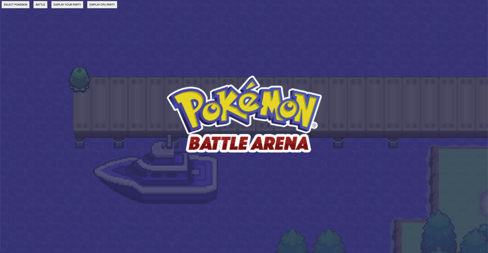

### <b>POKEMON ARENA GAME </b>

### Project Description:
My app is a Pokemon arena where a user can select 3 pokemon and choose 4 moves. The user can battle the pokemon they choose and also choose the Pokemon and moves they go against. When a pokemon reaches 0 HP, the pokemon faints and the user sends out the next pokemon to fight in the arena. Once there is a winner or a loser, the site needs to be refreshed and the game will restart and User can select Pokemon again. (All Pokemon and moves are available)

** Only the first 151 are displayed, but all 905 pokemon is available through the PokeAPI.

### Technologies Used:
HTML, CSS, JSON, and JavaScript.

### Deployed Link:
https://jrkprogramming.github.io/GA_project1/

### <b>Screenshots:</b>

Welcome screen where users can choose to select their Pokemon.

Pokemon will populate and user can choose which Pokemon and which moves they want to battle with/against. (Only Generations 1-3 are shown)

This is the battle screen where user can battle the CPU.

### MVP:

- As a player, I want to select the pokemon I want to use in battle.
- As a player, I want to choose any Pokemon from the series.
- As a player, I want to be able to choose which set of pokemon I want to battle against.
- As a player, I should only be able to battle with one Pokemon at a time. 
- As a player, I should know how much HP is left on my Pokemon and my opponent’s.
- As a player, I should be able to choose which of the 4 moves I want to do per round.

### Stretch Goals:

- Add dual types to pokemon
- Add more stages.
- Upgrade from alert boxes and make a game text box on screen
- Add animations to moves and sprites
- Factor in accuracy into the battles
- Incorporate berries/items
- Incorporate special moves
- User can change out pokemon
- User should not be able to add the same move twice
- Add loading screen so that User can't try to access a Pokemon that hasn't fully loaded yet
- Display Party buttons need styling
- Pokedex feature that has all the data on every pokemon
- Convert Frontend to React

### Major Hurdles:

- Manipulating data within a class and making sure to carry the data throughout the methods as intended was tricky.
- A lot of the times, the fetched data from the PokeAPI would return undefined so I had to play with code to get it to work.
- Difficult to calculate Pokemon damage, because I don't include IVs and EVs and the base stats don't even scale to the level. (Kept the damage formula the way it is because the game has a good length with those metrics.)
- The moves attached to the Pokemon data didn't have stats like power, accuracy, and type so i had to fetch all the moves that exist in the game and create a new array and compare the Pokemon moves to that 'all moves list' since that when the Pokemon get selected for battle, they have moves that have that data on them.
- Found a nice list of the Type Chart on GitHub, but then I had to find a way to implement that into my damage formula.
- Constantly had random bugs whether it was data loading in weird or things returning undefined and making sure the code is following the flow of the original Pokemon games.
- Didn't have a lot of practice with the DOM and CSS, so adding those elements to my game was a bit of a challenge.
- The PokeAPI having all the data really made things easy, the hard part was accessing the data and being able to maniulate them and interacting with them.
- Before having buttons for everything, I used prompts to get input from the user. The user would have to type in which Pokemon they wanted to add to their party and type which moves they wanted. Creating buttons was an obvious, important feature. (And as you can tell it was a pain to test before having buttons.)
- The app needs time to load. User need to click through the menu slowly or some things may not load right.
- Sometimes only 1 move list boxes will load when selecting a pokemon.