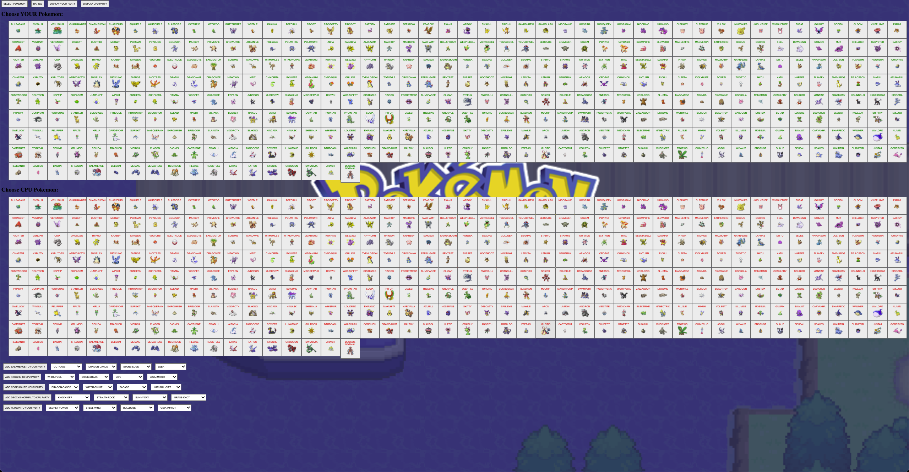
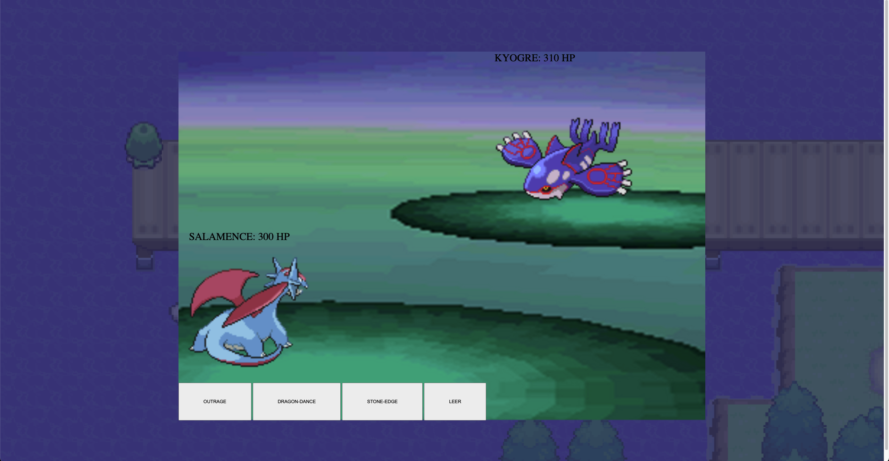

<b>POKEMON BATTLE ARENA</b>

Project Description:
My app is a Pokemon arena where a user can select 3 pokemon and choose 4 moves. The user can battle the pokemon they choose against a computer who randomly creates their team of pokemon. When a pokemon reaches 0 HP, the pokemon faints and the user has to choose the next pokemon to fight in the arena. (ALL POKEMON AND ALL MOVES ARE AVAILABLE)

Technologies Used:
This project is written in HTML, CSS, and vanilla JavaScript.

<b>Screenshots:</b>

Welcome screen where users can choose to select their Pokemon.

Pokemon will populate and user can choose which Pokemon and which moves they want to battle with/against. (Only Generations 1-3 are shown)

This is the battle screen where user can battle the CPU.

MVP Goals:

- As a player, I want to select the pokemon I want to use in battle.
- As a player, I want to choose any Pokemon from the series.
- As a player, I want to be able to choose which set of pokemon I want to battle against.
- As a player, I should only be able to battle with one Pokemon at a time. 
- As a player, I should know how much HP is left on my Pokemon and my opponent’s.
- As a player, I should be able to choose which of the 4 moves I want to do per round.

Stretch Goals:

- Add dual types to pokemon
- Add animations to moves
- Factor in accuracy into the battles
- Incorporate berries/items
- Incorporate special moves
- User can change out pokemon
- Pokedex feature that has all the data on every pokemon